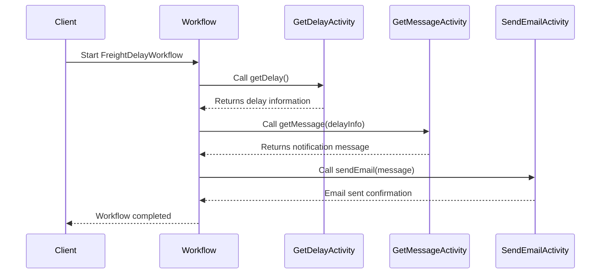

# Freight Delay Notification

This project demonstrates a freight delay notification system using Temporal.

### Running this sample

1. `temporal server start-dev` to start [Temporal Server](https://github.com/temporalio/cli/#installation).
1. `npm install` to install dependencies.
1. Copy `.env.example` to `.env` and set the required variables.
1. `npm run start.watch` to start the Worker.
1. In another shell, `npm run workflow` to run the Workflow Client.

### Workflow

The following diagram illustrates the workflow for freight delay notifications:

> Failures from Open AI API is handled gracefully.

### Missing Tests

To enhance test coverage and ensure robustness, the following areas require additional unit tests:

*   **Activities (`src/activities/`)**:
    *   `getDelay`: Test various scenarios for calculating delays.
    *   `getMessage`: Test successful message generation via LLM.
    *   `getDefaultMessage`: Test the fallback message generation.
    *   `sendEmail`: Test the email sending activity.

*   **Workflow Functions (`src/workflows.ts`)**:
    *   `handleMessageGeneration`: Test the logic for attempting LLM message generation and falling back to the default message on failure.

*   **Workflows (`src/workflows.ts`)**:
    *   `delayNotification`: Add more unit tests to cover different scenarios, including:
        *   Cases where there is no delay (`isDelayed` is false).
        *   Cases where activities fail and retries are handled.
        *   Edge cases for delay thresholds.

These tests should be added to their respective test files (e.g., `src/mocha/activities.test.ts` for activities and `src/mocha/workflows.test.ts` for workflow-related tests) to ensure full coverage and reliability.
