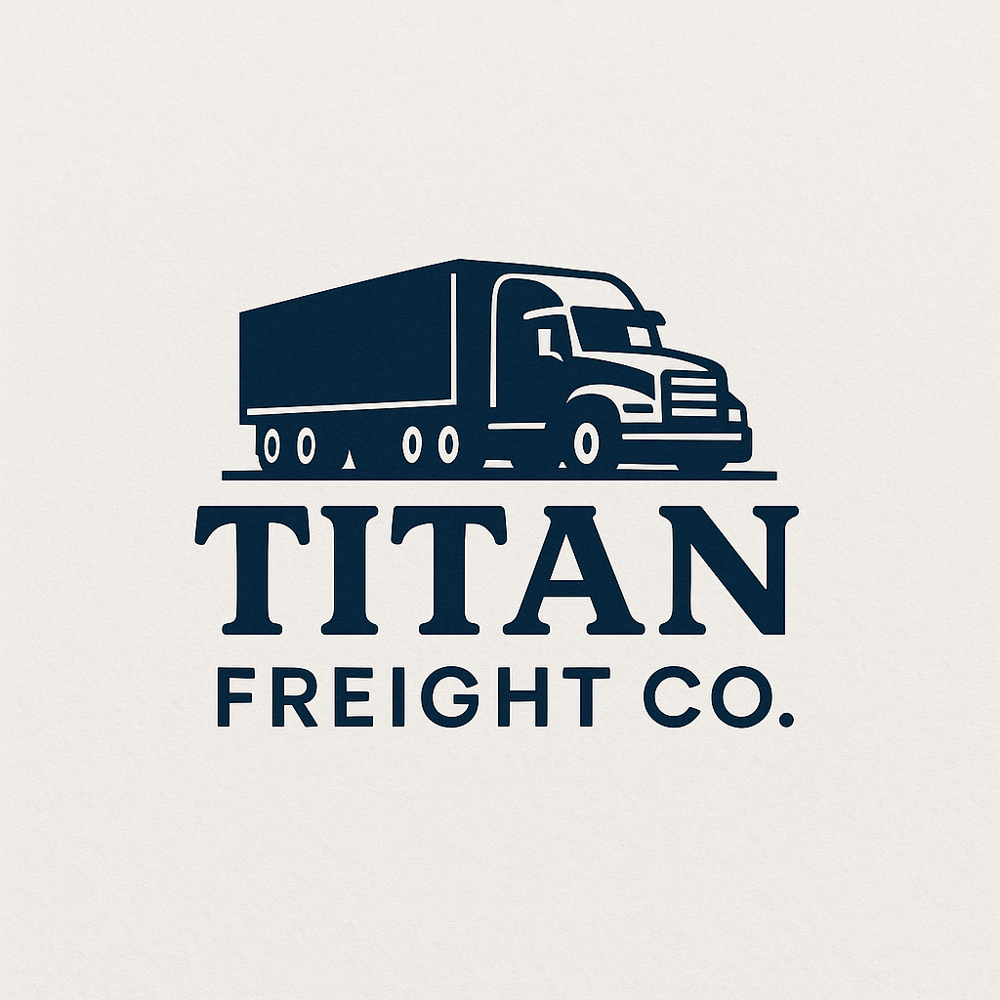
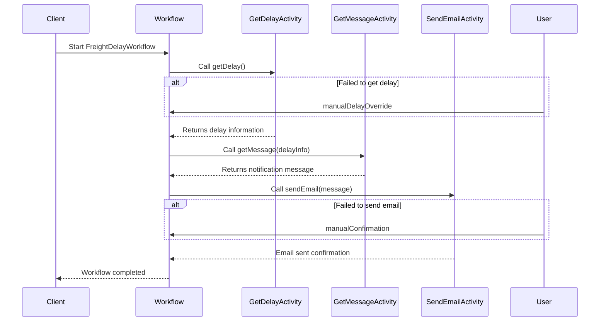

  

# Freight Delay Notification

This project demonstrates a freight delay notification system using Temporal.

### Running locally

- `temporal server start-dev` to start [Temporal Server](https://github.com/temporalio/cli/#installation).
- `npm install` to install dependencies.
- Copy `.env.example` to `.env` and set the required variables.
- `npm run start.watch` to start the Worker.
- In another shell, `npm run workflow` to run the Workflow Client.

### Running tests
- `npm run test`

### Workflow

The following diagram illustrates the workflow for freight delay notifications:

> Failures from Open AI API, Google Maps API and Resend API is handled gracefully.

## License

This project is licensed under the MIT License.
